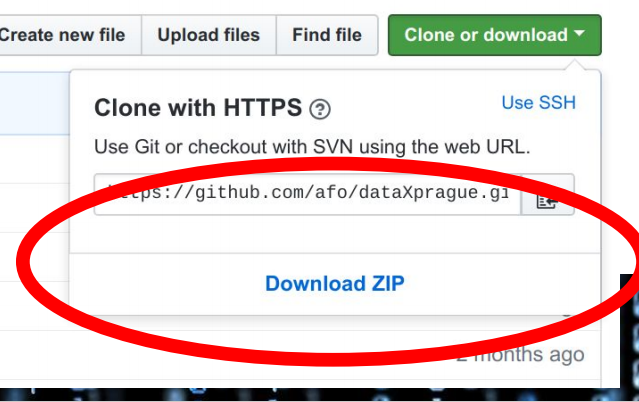
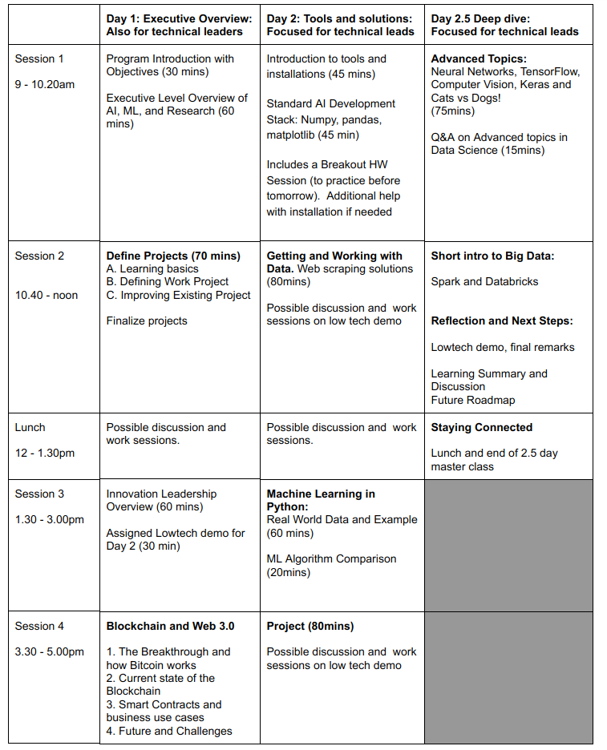

<a href="https://data-x.blog/">
   
</a>


2.5 Day Masterclass, HKBU
======================


### May 23-25, 2018

This is the official Github repository for the Masterclass.

#### High level outline:
* **Day 1:** Introduction to AI and Overview, Project Setup, Code Samples and Introduction to Data Analytics,  Business & Venture Applications, Get Value from your Data
* **Day 2:** Innovation Leadership, Webscraping, Challenges in Data Science, Project Updates and Architecture, Big Data and Cloud Computing, The Future of Data Strategies, Advanced topics, Reflection and Next Steps
* **Day 3:** Blockchain Overview, Blockchain Business Use Cases, Project Deliverables, Demo or Die, Staying Connected

<a href='https://data-x.blog'>

</a>


## 📚 Resources

* ## [Install Instructions and Prep Material](https://github.com/afo/dataXhkbu/blob/master/install-instructions/setup-installation-masterclass.pdf)
* ### [Data-X Official Website](https://data-x.blog/)
* ##### [Data-X Network](https://data-x.blog/advisors/)
* ##### [Data-X Resources](https://data-x.blog/resources/)
* ##### [Data-X Projects](https://data-x.blog/projects/)


### Download the Masterclass material

To download this Github repository just press the green `Clone or Download` button to the top right.

<p align='center'>
   
</p>
<br>


___

## 📝 Masterclass Schedule

<p align='center'>
   
</p>
<br>


## ▶️ Usage

To download the material to your computer please [Install git](https://git-scm.com/downloads) and use the Terminal / Command Prompt to clone the repository.

```bash
git clone https://github.com/afo/dataXhkbu/
```

Every time the repository is updated, to get the most recent version, `cd` to the cloned `dataXhkbu` folder and run:

```bash
git pull
```

*For more information about Version Control, git, and Github please read this excellent guide: [Introduction to git and Github](https://product.hubspot.com/blog/git-and-github-tutorial-for-beginners)*

---

<h1 align="center">
  <br>
   
  <br>
</h1>
<h1 align="center">
   
</h1>


## 📧 Contact us

- **Ikhlaq Sidhu:** sidhu @ berkeley edu ([LinkedIn](https://www.linkedin.com/in/ikhlaq/))
- **Alexander Fred Ojala:** afo @ berkeley edu ([LinkedIn](https://www.linkedin.com/in/alexanderfo/))

## 📁 About the Bootcamp

Today, the world is literally reinventing itself with Data and AI.  However, neither leading companies nor the world’s top students have the complete knowledge set to participate in this newly developing world.  This 2-day course provides the tools and understanding to boost any student’s ability to create the emerging data applications of the future.  This bootcamp is suitable for individuals interested in hands-on practical understanding of data science and application opportunities in new ventures, industry project areas, and potential support of research with data technologies.

This bootcamp is set of intensive topics selected from the the Applied Data Science with Venture Applications Course at UC Berkeley (IEOR 135/290).  The bootcamp is a high paced immersion into data and data science principles in a uniquely practical approach.  The 2-day program contains theory segments, code samples in Python and in Jupyter Notebooks, and a real-life wide ranging project that can be started over the first 2 days with guidance for instructors.  The course includes a real life code development project.


## ❤️ Credits

List of Dependencies:

* [Python 3](https://www.python.org/)
* [Jupyter](https://jupyter.org/)
* [Anaconda](https://www.anaconda.com/)
* [NumPy](http://www.numpy.org/)
* [Pandas](https://pandas.pydata.org/)
* [Matplotlib](https://matplotlib.org/)
* [Scikit-Learn](http://scikit-learn.org/stable/index.html)
* [TensorFlow](https://www.tensorflow.org/)
* [Keras](https://keras.io/)

## 🎓 License

[Apache2](https://www.apache.org/licenses/LICENSE-2.0)

<br><br>

<p align='center'>
   <a href='https://data-x.blog'></a>
</p>
<br>
