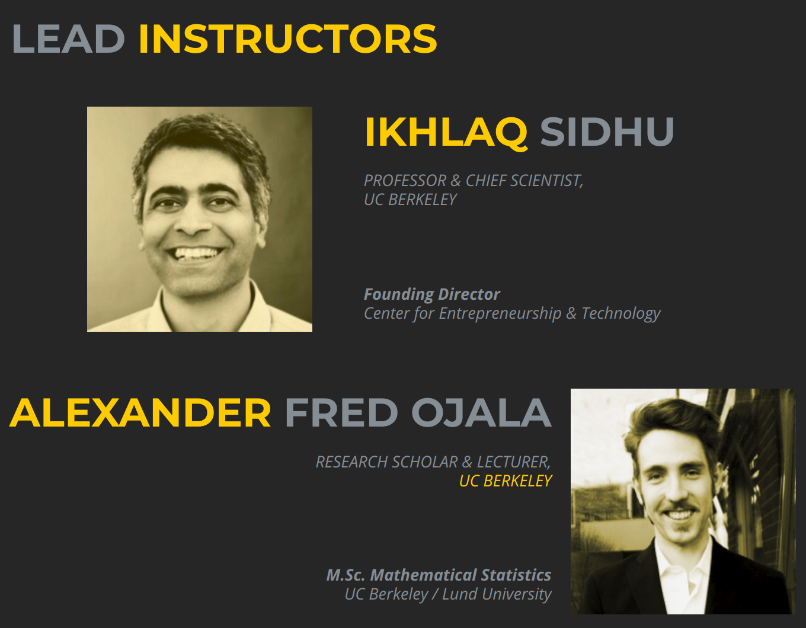

<a href="https://data-x.blog/">
   
</a>

2 Day Masterclass at HKBU
======================


### January 25 - 26, 2018

This is the official Github repository for the 2 day Masterclass.

#### High level outline:
* **Day 1:** Introduction to AI and Overview, Project Setup, Code Samples and Introduction to Data Analytics,  Business & Venture Applications
* **Day 2:** Innovation Leadership, Getting Data / Webscraping, Project Updates and Architecture, Deep Learning and Convolutional Neural Networks, Reflection and Next Steps

<a href='https://data-x.blog'>

</a>


## 📚 Resources

* ### [Dropbox Link to all Material](https://www.dropbox.com/sh/i5cjhvqeing9gx0/AAAd_OlM_xL3YEuYg2c9HvXMa?dl=0)
* ### <a href='https://join.slack.com/t/dataxhkbu/shared_invite/enQtMzAyMDE2MjE0NDM1LTFmNjk1NDkzZTkyYzM3NzliOGU5NGJiNDBkMGM5ODVhNjMzMzQwZGFkNTkyNGQwOTQwMWMwYmNkZWFmMTEyNDk' target='_blank'> `dataXhkbu` Slack Channel   </a>
* ### [Data-X Official Website](https://data-x.blog/)
* ##### [Data-X Network](https://data-x.blog/advisors/)
* ##### [Data-X Resources](https://data-x.blog/resources/)
* ##### [Data-X Projects](https://data-x.blog/projects/)


___

## 📝 Masterclass Schedule

**Time** | **Day 1: Breadth**  | **Day 2: Depth** |
:--|:--|:-
**Session1** <br> 9.00 - 10.20am | Program Introduction with Objectives (20mins)<br><br>Executive Level Overview of AI, ML, and Research (40mins)<br><br>Introduction to tools and installations (20mins) | Innovation Leadership Overview (30mins)<br><br>Getting and Working with Data (50mins)
**Session2** <br> 10.40 - noon | **Define Projects:**<br>A. Learning Basics<br>B. Defining Work Project<br>C. Improving Existing Project<br><br>Finalize projects | Architecture Discussion and Feedback with Lowtech demo presentations (80mins)
**Lunch** <br> 12.00 - 1.30pm | *Possible Discussion and Work Session* | *Possible Discussion and Work Session*
**Session3** <br> 1.30 - 3.00pm | **Standard AI Development Stack:**<br>Numpy, Pandas, Matplotlib<br><br>Includes a Breakout HW Session | **Advanced Topics** (75mins)<br>- Neural Networks<br>- TensorFlow<br>- Computer Vision<br>- Keras and Cats vs Dogs!<br><br>Q&A on Advanced topics in Data Science (15mins)
**Session4** <br> 3.30 - 5.00pm | **Machine Learning in Python:**<br>- Real World Data and Example (60 mins)<br>- ML Algorithm Comparison (20mins)<br>- Reflection and Q&A (10mins) |**Next Steps:**<br>- Learning Summary and Discussion<br>- Future Roadmap<br>- Staying Connected


## ▶️ Usage

To download the material to your computer please [Install git](https://git-scm.com/downloads) and use the Terminal / Command Prompt to clone the repository.

```bash
git clone https://github.com/afo/dataXhkbu/
```

Every time the repository is updated, to get the most recent version, `cd` to the cloned `dataXhkbu` folder and run:

```bash
git pull
```

*For more information about Version Control, git, and Github please read this excellent guide: [Introduction to git and Github](https://product.hubspot.com/blog/git-and-github-tutorial-for-beginners)*

---

<h1 align="center">
  <br>
   
  <br>
</h1>


## 📧 Contact us

- **Ikhlaq Sidhu:** sidhu @ berkeley edu ([LinkedIn](https://www.linkedin.com/in/ikhlaq/))
- **Alexander Fred Ojala:** afo @ berkeley edu ([LinkedIn](https://www.linkedin.com/in/alexanderfo/))

## 📁 About the Bootcamp

Today, the world is literally reinventing itself with Data and AI.  However, neither leading companies nor the world’s top students have the complete knowledge set to participate in this newly developing world.  This 2-day course provides the tools and understanding to boost any student’s ability to create the emerging data applications of the future.  This bootcamp is suitable for individuals interested in hands-on practical understanding of data science and application opportunities in new ventures, industry project areas, and potential support of research with data technologies.

This bootcamp is set of intensive topics selected from the the Applied Data Science with Venture Applications Course at UC Berkeley (IEOR 135/290).  The bootcamp is a high paced immersion into data and data science principles in a uniquely practical approach.  The 2-day program contains theory segments, code samples in Python and in Jupyter Notebooks, and a real-life wide ranging project that can be started over the first 2 days with guidance for instructors.  The course includes a real life code development project.


## ❤️ Credits

List of Dependencies:

* [Python 3](https://www.python.org/)
* [Jupyter](https://jupyter.org/)
* [Anaconda](https://www.anaconda.com/)
* [NumPy](http://www.numpy.org/)
* [Pandas](https://pandas.pydata.org/)
* [Matplotlib](https://matplotlib.org/)
* [Scikit-Learn](http://scikit-learn.org/stable/index.html)
* [TensorFlow](https://www.tensorflow.org/)
* [Keras](https://keras.io/)

## 🎓 License

[Apache2](https://www.apache.org/licenses/LICENSE-2.0)

<br><br>

<p align='center'>
   <a href='https://data-x.blog'></a>
</p>
<br>
